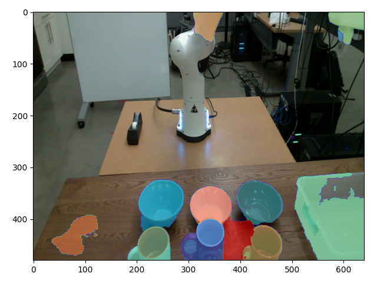
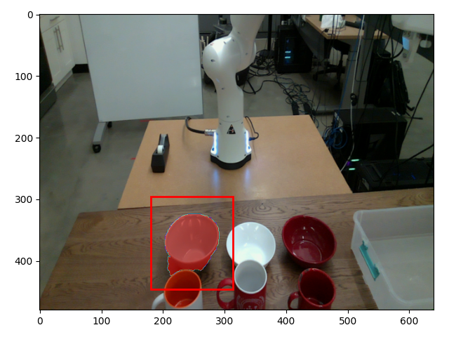
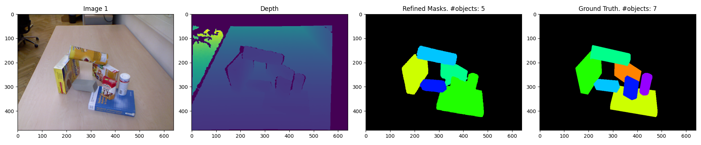
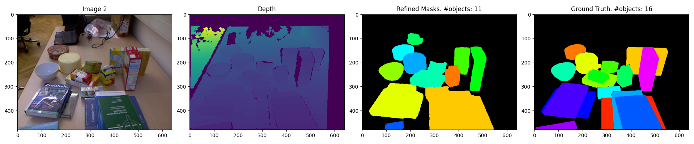
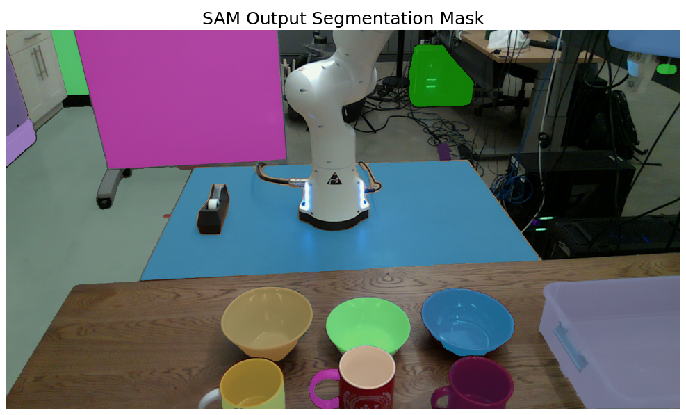
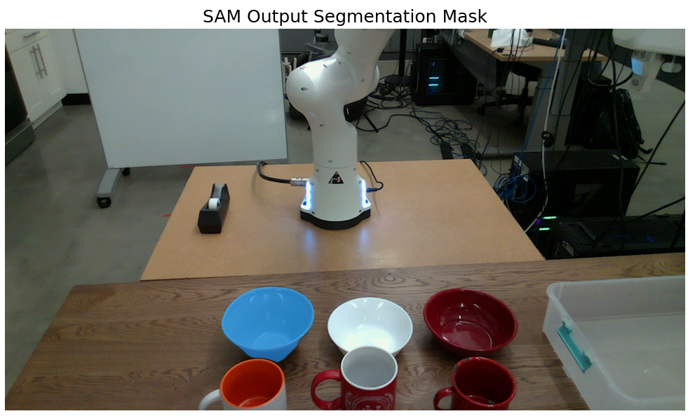
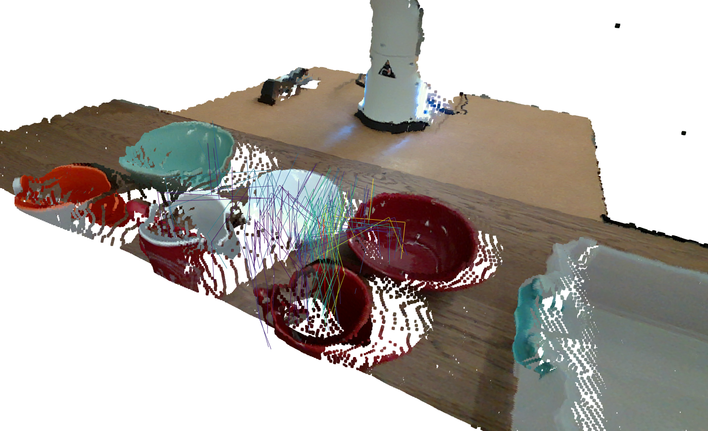
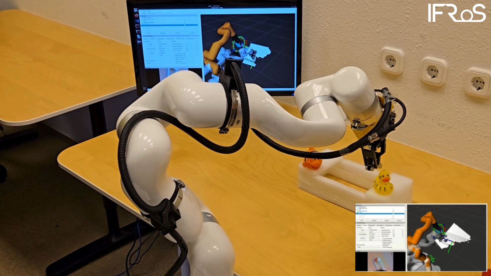
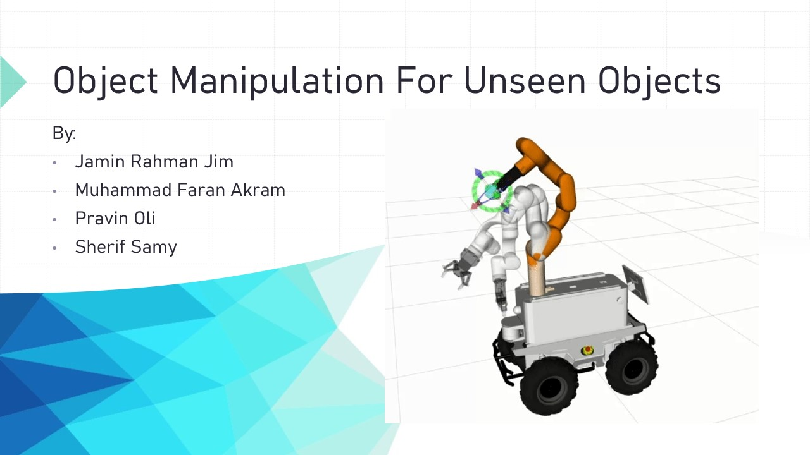

# Grasping Manipulator for Unseen Objects  
**A Dual-ROS Dockerized Framework for Perception-Driven Robotic Manipulation**


---
###  👥 Team Members

- **Sherif Sameh**
- **Muhammad Faran Akram**
- **Pravin Oli**
- **Jamin Rahman Jim**

---
### Course Information

**Subject:** IFRoSLab – ELTE University  
**Course:** Intelligent Field Robotics Systems (Erasmus Mundus Joint Masters)

---

## 1. INTRODUCTION

This project presents a **modular object manipulation system** that integrates:

- **MoveIt-based motion planning**
- **Instance segmentation for unseen objects**
- **Learning-based grasp estimation**

The system runs across **ROS Melodic** (robot drivers & simulation) and  
**ROS Noetic** (AI, perception & Python 3) using a **dual-container Docker architecture**.

---

### Robot Platform

| Component | Description |
|---------|------------|
| **Mobile Base** | AgileX Scout (Scout 2.0) |
| **Manipulator** | UFactory xArm6 |
| **Gripper** | DH Robotics AG95 |
| **Sensors** | RGB-D Camera (Intel RealSense) |

---

### Key Technologies

- **ROS1:** Melodic & Noetic
- **MoveIt:** Motion planning & execution
- **Gazebo:** Physics-based simulation
- **Contact-GraspNet:** Learning-based grasp estimation
- **Instance Segmentation:** Perception of unseen objects
- **Docker & Docker Compose:** Reproducible development

---

### Project Focus

- Vision-based object manipulation
- Clean separation of **robot control** and **AI perception**
- Reproducible robotics research using containerized ROS

---

## 2. CLONE THIS REPO.

Clone the project repository to your local machine:

```bash
git clone https://github.com/IFRoS-ELTE/obj_manipulation.git
cd obj_manipulation
```
---
### Notes
Make sure Git is installed on your system:
```bash
git --version
```
The repository contains all ROS packages, Docker configuration, and perception modules required to run the system.

No submodules are required for this repository.

### Expected Result

After cloning, your directory should look like:

```text
obj_manipulation/
├── docker/
├── obj_manipulation/
├── tests/
├── README.md
└── ...
```
---
## 3. DOCKER SETUP (Dual ROS Containers)

This project uses a **dual-container Docker setup** to run two ROS1  distributions simultaneously:

- **ROS Melodic**  
  Used for robot drivers, MoveIt motion planning, and Gazebo simulation (Python 2). 

- **ROS Noetic**  
  Used for perception, instance segmentation, and grasp estimation (Python 3).

---

### Clarification for Dual ROS Containers
Real robot hardware uses ros1 ubuntu 18 but our grasp and segment model uses python-3 , that's why dual container setup is needed.

Both containers communicate using **shared ROS1 networking**, allowing seamless data exchange between perception and manipulation pipelines.

---

###  Docker Directory

All Docker-related files are located in:

```text
docker/
├── docker-compose.yml
├── melodic.Dockerfile
├── noetic.Dockerfile
└── ...
```
---

### Build Docker Images
From the project root directory, build both Docker images:

```bash
cd docker
docker compose build --no-cache
```

This step may take several minutes during the first build.

---

### Start the Containers

Launch both containers in detached mode:

```bash
docker compose up -d
```

Alternatively, you can run Docker Compose from the project root:
```bash
docker compose -f docker/docker-compose.yml up -d
```
---

### Access the Containers

Open separate terminals for each container:

```bash
# Terminal-1: ROS Melodic container (Robot + MoveIt)
docker compose exec melodic bash
```

```bash
# Terminal-2: ROS Noetic container (Perception + Python 3)
docker compose exec noetic bash
```
---


### Container Responsibilities

| Container | Purpose |
|---------|------------|
| **Melodic** | melodic	Scout + xArm6 drivers, MoveIt planning, Gazebo simulation |
| **Noetic** | Instance segmentation, grasp estimation, Python 3 manipulation nodes |


---


### Stop the Containers

To stop and remove all running containers:
```bash
docker compose down
```
---
### Notes

The ROS environment is automatically sourced inside each container.

The shared workspace is located at:
```text
/catkin_ws/src/obj_manipulation
```

Both containers share the same ROS master for communication.

**Quick commands:**
```bash
# Access robot container
docker compose exec -it <Container Name> bash

# Stop everything
docker compose down
```

---

## 4. BUILD WORKSPACE (ROS1)

Before running any nodes, you need to **build the Catkin workspace** inside the containers.

---

### Container Environment

- **Working Directory:** `/catkin_ws`  
- **Project Location:** `/catkin_ws/src/obj_manipulation`  
- **ROS Environment:** Automatically sourced from `/opt/ros/noetic/setup.bash` (Noetic) or `/opt/ros/melodic/setup.bash` (Melodic)

---

### Build the Workspace

Inside **either container**, run:

```bash
cd /catkin_ws
catkin_make
source /catkin_ws/devel/setup.bash
```
---

### Test Melodic &  Noetic Connection

Open three terminals: Two for Melodic (robot/simulation) and one for Noetic (perception/AI).

#### Terminal 1: Melodic container (Robot + MoveIt)

```bash
cd /catkin_ws
catkin_make
source /catkin_ws/devel/setup.bash
```

```bash
# Launch Scout xArm6 simulation
roslaunch obj_manipulation scout_xarm_moveit.launch
```
---

#### In new melodic terminal: Run Python manipulation script in Melodic

```bash
cd /catkin_ws
catkin_make
source /catkin_ws/devel/setup.bash

rosrun obj_manipulation xarm_move.py
```
---

#### Terminal 2: Noetic container (Perception + Python 3)

```bash
cd /catkin_ws
catkin_make
source /catkin_ws/devel/setup.bash

rosrun obj_manipulation xarm_moveit_noetic.py
```

After this, Melodic and Noetic containers should communicate properly through the shared ROS network.

---

## 5. LAUNCH ROBOT

This section covers launching the Scout + xArm6 robot system in **simulation** or **real hardware**, as well as using perception nodes and MoveIt commander.

---

### Launching in Simulation (Default Launch)

```bash
roslaunch obj_manipulation scout_xarm_moveit.launch
```
---

### With Gazebo simulation:
```bash
roslaunch obj_manipulation scout_xarm_moveit.launch gazebo:=true
```

### With GPU acceleration for Gazebo:
```bash
__NV_PRIME_RENDER_OFFLOAD=1 __GLX_VENDOR_LIBRARY_NAME=nvidia roslaunch obj_manipulation scout_xarm_moveit.launch gazebo:=true
```

### With Joint State Publisher GUI:
```bash
roslaunch obj_manipulation scout_xarm_moveit.launch use_gui:=true
```
---

### Launching on Real Hardware (Inside Robot)

#### Silvanus Robot:
```bash
roslaunch agx_xarm_bringup scout_xarm_moveit.launch use_real_hardware:=true
```

#### Control Gripper:
```bash
rosrun agx_xarm_pick control_gripper
```
---

### Sourcing ROSMaster on User Local Machine

Configure your environment to communicate with the robot remotely:

```bash
source devel/setup.bash
export ROS_MASTER_URI=<robot IP>  
export ROS_IP=<local machine ip>
```

#### Verify ROS connectivity:
```bash
rostopic list
```

#### Run Python MoveIt test script:
```bash
python src/obj_manipulation/scripts/xarm_move.py
```

#### Opening Rviz in docker:
```bash 
rviz -d src/obj_manipulation/rviz/silvanus.rviz
```

#### Python MoveIt Commander
```bash
source /catkin_ws/devel/setup.bash
python src/obj_manipulation/scripts/xarm_move.py
```
---

### High-Level Motion Flow
```text
Start
 ├─ ROS init (node, MoveIt)
 ├─ Configure group (frame, tolerances, time, attempts, scaling)
 ├─ Prompt user → (x,y,z)
 ├─ Build target pose + publish RViz marker
 ├─ Set start state → set pose target
 │   └─ OMPL plan
 │       ├─ Success → execute
 │       └─ Fail → Cartesian path
 │           ├─ fraction > 0.7 → execute
 │           └─ else → report failure
 └─ Stop, clear, shutdown
 ```

#### Using move_node

move_node subscribes to /grasp_estimation_node/grasp_pose and /move_node/allow_execution to execute planned trajectories.

Make the script executable:
```bash 
chmod +x src/obj_manipulation/scripts/move_node.py
```

Run the node:
```
rosrun obj_manipulation move_node
```

Subscribed Topics:

- /grasp_estimation_node/grasp_pose → Target grasp poses (x, y, z, quaternion)

- /move_node/allow_execution → Execution trigger (std_msgs/Bool)

Trigger execution manually:
```bash 
rostopic pub /move_node/allow_execution std_msgs/Bool "data: true"
```

## 6. UNSEEN OBJECT INSTANCE SEGMENTATION 

#### NOTE: Follow segment/models/README.md to download pre-trained weights.

#### Run segmentation node:
```bash 
rosrun obj_manipulation segmentation_node.py
```

#### Grasp Estimation (Contact-GraspNet)

Download pre-trained weights (see grasp/models/README.md).

Run the node:
```bash 
rosrun obj_manipulation grasp_estimation_node.py
```

Trigger grasp prediction manually:
```bash 
rostopic pub /grasp_estimation_node/trigger std_msgs/Bool "data: true"
```

## 7. GRASP ESTIMATION (Contact-GraspNet)

The **grasp estimation module** uses Contact-GraspNet to predict grasps for unseen objects based on RGB-D input.  

---

### Pre-trained Weights

Follow the instructions in:

- [`obj_manipulation/grasp/models/README.md`](./obj_manipulation/grasp/models/README.md) to download pre-trained weights.
- [`tests/grasp/examples/README.md`](./tests/grasp/examples/README.md) to verify the model works correctly.

---

### Running the Grasp Estimation Node

Launch the node in the **Noetic container**:

```bash
rosrun obj_manipulation grasp_estimation_node.py
```
Note: The node stores the latest RGB and Depth images but does not automatically perform grasp prediction.

---

### Trigger Grasp Prediction

Manually trigger grasp prediction using the ROS topic:
```bash
rostopic pub --once /move_node/allow_execution std_msgs/Bool "data: true"
```

- Message Type: std_msgs/Bool

- Data: true → triggers a single grasp prediction attempt using the latest stored images.

This design ensures that grasp prediction runs only when explicitly requested, avoiding repeated computation at the sensor update rate.

---


## 8. RESULTS

### 

### 8.1 Point Cloud Pre-processing

Raw point cloud data is filtered to remove noise and isolate the workspace using voxel filtering and pass-through constraints.





### 8.2 Instance Segmentation

Individual objects are segmented from the scene using instance segmentation techniques, enabling object-level manipulation.





### 8.3 SAM-based Object Selection

The Segment Anything Model (SAM) is used for both automatic and user-guided object selection, producing high-quality segmentation masks.





### 8.4 Grasp Pose Estimation

Grasp candidates are generated from the segmented object point cloud, and the optimal grasp pose is selected for execution.



## 9.Video & Presentation


**Object Manipulation Demo Video**

[](https://drive.google.com/drive/folders/1G90wd-KYNR6D9cJWEA4nhOD_YlCktPKP?usp=drive_link)

*Click the image to watch the full demo video.*


**Object Manipulation Presentation Slide**
[](files/presentation/presentation.pdf)


## 10. TROUBLESHOOTING

If you encounter issues while running the system, refer to these common fixes:

- **RViz / MoveIt cannot load gripper meshes** (`package://dh_robotics_ag95_model/...`):

  1. Ensure the workspace and ROS environment are properly sourced:

  ```bash
  source /opt/ros/melodic/setup.bash   # or noetic, depending on container
  source /catkin_ws/devel/setup.bash
  rospack find dh_robotics_ag95_model
    ```

Rebuild the workspace if needed:
  ```bash
Copy code
cd /catkin_ws
catkin_make
  ```

Other tips:

- Make sure Docker containers are running and sourced correctly.

- Verify that ROS topics and nodes are communicating (rostopic list, rosnode list).

- Check GPU drivers if using Gazebo with hardware acceleration.


## 11. ADDITIONAL RESOURCES
Helpful links for hardware and software documentation:

 Agilex official Repo
 https://github.com/agilexrobotics

UFactory xArm6 official repo
https://github.com/xArm-developer

DH Robotics official repo
https://github.com/DH-Robotics/dh_gripper_ros


ROS Documentation:
ROS Melodic
https://wiki.ros.org/melodic 

ROS Noetic
https://wiki.ros.org/noetic

MoveIt Motion Planning:
https://docs.ros.org/en/kinetic/api/moveit_tutorials/html/index.html

