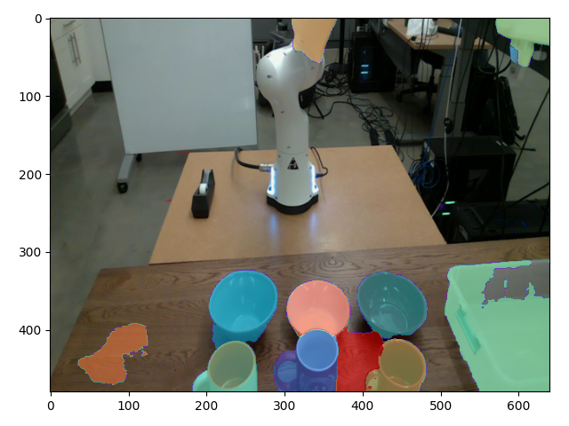
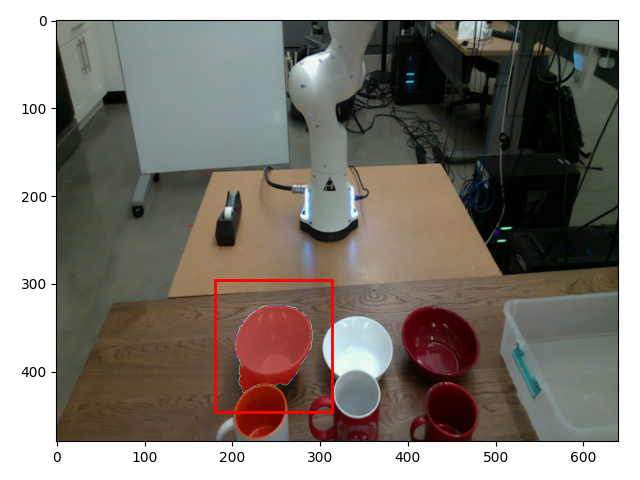
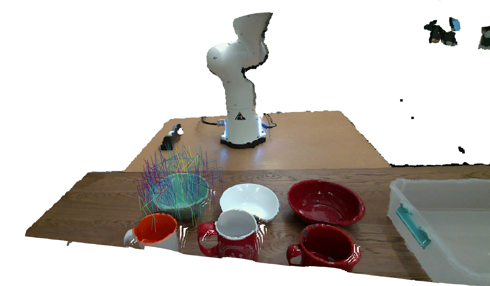

# Download Examples

You can download the test examples for the grasp estimation module from the following [link](https://drive.google.com/drive/folders/1AtZvhrpF-UjZ15r1o7QjC5r1mnE5miKG?usp=sharing).
Download all files and place them inside this `examples` directory.


# Run Test

Firstly, make sure that you have already downloaded the grasp estimation module's pre-trained weights or have trained it yourself and saved its weights. 
To download the pre-trained weights, follow the insturctions given in the following [`README.md`](../../../obj_manipulation/grasp/models/README.md) file.

Additionally, since grasp estimation relies on instance segmentation, you must first ensure that the instance segmentation module works as expected.
To do this, follow the instructions given in the following [`README.md`](../../segment/examples/README.md) file.

Although not neccesary, you can run the following script to see how the scene is segmented and extracted local point cloud that is to be used for grasp predicition.

```bash
# Setup ROS package environment variables
cd /catkin_ws
catkin_make
source devel/setup.bash

# Run test script
cd /catkin_ws/src/obj_manipulation
python3 tests/grasp/pc_filter_test.py -f 0.npy
```

Then, you can run the following grasp estimation test script to ensure that the model works as expected.

```bash
# Setup ROS package environment variables
cd /catkin_ws
catkin_make
source devel/setup.bash

# Run test script
cd /catkin_ws/src/obj_manipulation
python3 tests/grasp/grasp_test.py -f 0.npy
```

# Expected Results

The following figure represents the expected segmentation and object selection results from the `pc_filter_test.py` test script.
<p align="center">
  
  
</p>

Lastly, the following figure showcases the expected grasp estimation results from the `grasp_test.py` test script.
The colors of the shown grasps represent their predicted success probabilities.
All grasps are shown with a fixed grasp width set to the gripper's width.
<p align="center">
  
</p>