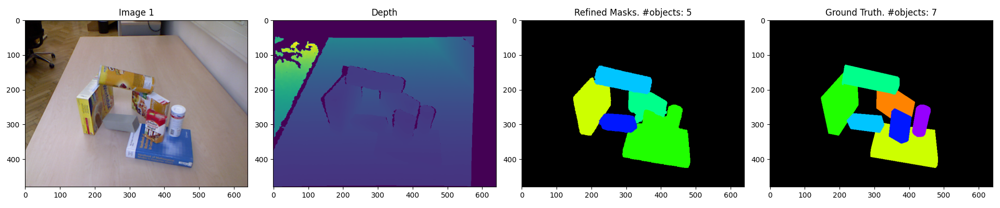
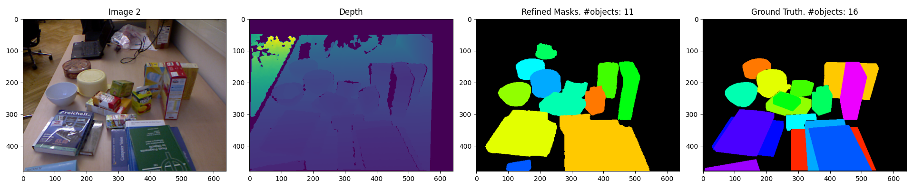

# Download Examples

You can download the test examples for the instance segmentation module from the following [link](https://drive.google.com/drive/folders/1UYn42QL-Wj7qFGC36wFlUS30bvaxTsgK?usp=sharing). 
Download all files and place them inside this `examples` directory.


# Run Test

Firstly, make sure that you have already downloaded the instance segmentation module's pre-trained weights or have trained it yourself and saved its weights. 
To download the pre-trained weights, follow the insturctions given in the following [`README.md`](../../../obj_manipulation/segment/models/README.md) file. 

Then, you can run the following instance segmentation test script to ensure that the model works as expected.

```bash
# Setup ROS package environment variables
cd /catkin_ws
catkin_make
source devel/setup.bash

# Run test script
cd /catkin_ws/src/obj_manipulation
python3 tests/segment/segmentation_test.py
```

# Expected Results

The following figure represents a sample of the expected results.
<p align="center">
  
  
</p>

**Note**: These results are not identical to the original implementation only because we make use of a slightly different configuration. 
Our configuration is more suited towards larger objects and less cluttered scenes. 
If the same configuration from the original implementation is used instead, the output segmentation masks are identical to their original counterparts.